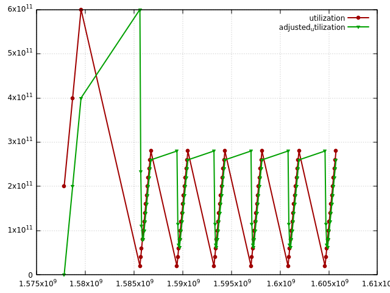

# rentbw modeling tool

mkdir build

cd build

cmake -DBUILD_TESTS=true ..

make -j

from the project folder execute:

## Build

To build the contracts follow the instructions in [Build and deploy](https://developers.eos.io/manuals/eosio.contracts/latest/build-and-deploy) section.

## Contributing

[Contributing Guide](./CONTRIBUTING.md)

[Code of Conduct](./CONTRIBUTING.md#conduct)

## License

[MIT](./LICENSE)

The included icons are provided under the same terms as the software and accompanying documentation, the MIT License.  We welcome contributions from the artistically-inclined members of the community, and if you do send us alternative icons, then you are providing them under those same terms.

## Important

See [LICENSE](./LICENSE) for copyright and license terms.

All repositories and other materials are provided subject to the terms of this [IMPORTANT](./IMPORTANT.md) notice and you must familiarize yourself with its terms.  The notice contains important information, limitations and restrictions relating to our software, publications, trademarks, third-party resources, and forward-looking statements.  By accessing any of our repositories and other materials, you accept and agree to the terms of the notice.

## rentbw modeling tool

`mkdir build`

`cd build`

`cmake -DBUILD_TESTS=true ..`

`make -j`

from the project folder execute:

`cd modeling`

`sh run_and_plot.sh model_config.json rentbw_input.csv csv_output.csv`

if you have a gnuplot installed, it will be automatically executed to plot utilization charts
